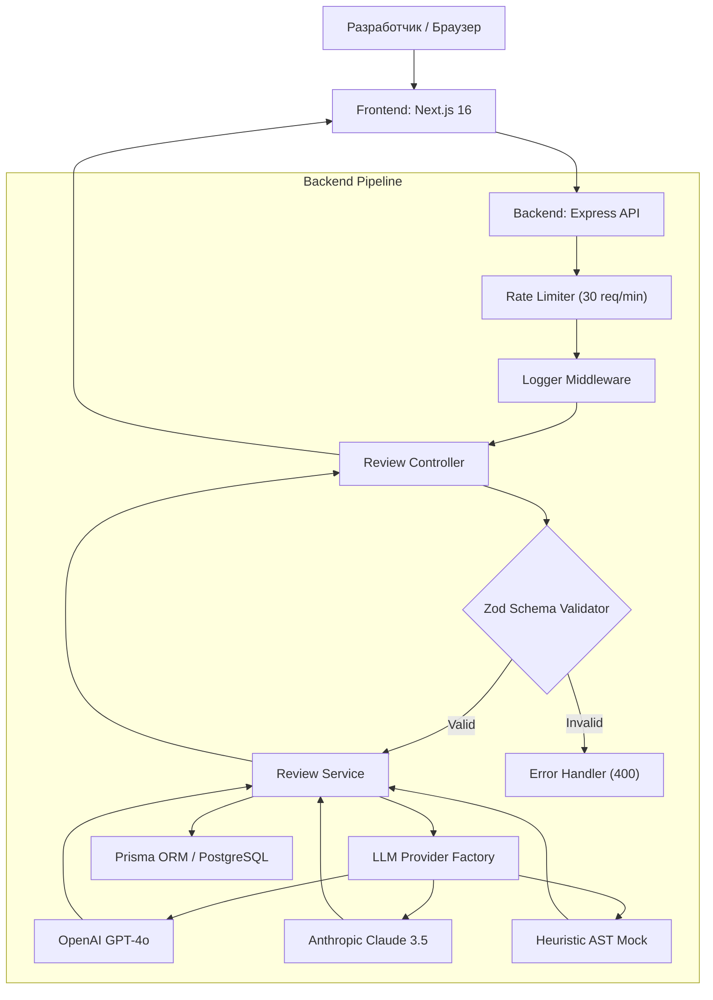

# 🤖 ReviewPulse — AI Code Reviewer for Pull Requests & Snippets

[](https://ai-code-reviewer-eight-vert.vercel.app/)
[](https://www.typescriptlang.org/)
[-black.svg)](https://nextjs.org/)
[](https://expressjs.com/)
[](https://tailwindcss.com/)
[](https://www.prisma.io/)

> **ReviewPulse** — это production-ready сервис для автоматизированного анализа Pull Request'ов и сниппетов исходного кода на базе AI с гарантированно структурированным JSON-ответом, многоуровневым обнаружением уязвимостей и генерацией готовых патчей.  
> 🌐 **Live Demo:** [ai-code-reviewer-eight-vert.vercel.app](https://ai-code-reviewer-eight-vert.vercel.app/)  

---

## 🌟 Ключевые возможности

* **Двухпанельный сплит-интерфейс:**
  * **Input Panel:** Выбор из 12 языков программирования, настройка фокуса ревью (Security, Performance, Clean Code), редактор кода с подсветкой и пресеты реальных уязвимостей (SQLi, утечки памяти).
  * **Output Panel:** Круговой спидометр рейтинга качества кода (0-100), фильтрация проблем по критичности, карточки с готовыми патчами и возможностью быстрого экспорта в PR.
* **Backend Архитектура:**
  * Встроенный статический анализатор (Heuristic AST Mock) для работы "из коробки" без ключей.
  * Интеграция с OpenAI (GPT-4o) и Anthropic (Claude 3.5 Sonnet) через Structured Outputs.
  * Middleware для логирования и Rate Limiting (лимит запросов).
  * Поддержка PostgreSQL через Prisma ORM.

---

## 📐 Архитектурная схема



---

## 📂 Структура проекта

```text
project#1/
├── backend/                  # Backend API сервис (Express + TypeScript)
│   ├── prisma/
│   │   └── schema.prisma     # PostgreSQL Prisma схема
│   ├── src/
│   │   ├── config/           # Валидация переменных окружения
│   │   ├── controllers/      # Контроллеры обработки ревью
│   │   ├── middlewares/      # Обработка ошибок, логгер, Rate Limit
│   │   ├── routes/           # Маршрутизация API v1
│   │   ├── schemas/          # Zod-схемы валидации
│   │   ├── services/         # Бизнес-логика и LLM-провайдеры
│   │   ├── types/            # TypeScript типы
│   │   └── server.ts         # Запуск сервера
│   ├── package.json
│   └── tsconfig.json
│
├── frontend/                 # Frontend приложение (Next.js 16)
│   ├── src/
│   │   ├── app/              # App Router, глобальные стили, Layout
│   │   ├── components/       # UI компоненты (Editor, Dashboard, Карточки)
│   │   ├── lib/              # API клиенты и утилиты
│   │   ├── store/            # Zustand стейт-менеджер
│   │   └── types/            # Интерфейсы Frontend
│   ├── package.json
│   └── tailwind.config.ts
│
└── README.md
```

---

## 🚀 Быстрый старт

### Требования
* Node.js v18.0.0+ (рекомендуется v20+)
* npm или pnpm

### Запуск приложения
Выполните из корневой директории установку зависимостей:
```bash
npm run install:all
```

Для одновременного запуска Backend (порт 4000) и Frontend (порт 3000):
```bash
npm run dev
```

Откройте в браузере `http://localhost:3000`.

---

## 🔑 Конфигурация API Ключей (Опционально)

Сервис работает "из коробки" с использованием встроенного эвристического анализатора. Если вы хотите подключить настоящие LLM:

1. Укажите ключи в файле `backend/.env`:
   ```env
   OPENAI_API_KEY="sk-..."
   ANTHROPIC_API_KEY="sk-ant-..."
   DEFAULT_LLM_PROVIDER="auto"
   ```
2. Или укажите ключ прямо в веб-интерфейсе, нажав на иконку настроек (Settings). Ключ будет сохранен локально в браузере.

---

## 📡 API Спецификация

### Анализ кода
`POST /api/v1/review/analyze`

**Request Body:**
```json
{
  "code": "import sqlite3\n\ndef get_user(uid):\n    cursor.execute(\"SELECT * FROM users WHERE id = \" + uid)",
  "language": "python",
  "focus": "security",
  "provider": "auto"
}
```

**Response (200 OK):**
```json
{
  "summary": "Review identified critical vulnerabilities. Remediation is required.",
  "score": 65,
  "issues": [
    {
      "severity": "critical",
      "line": 4,
      "title": "SQL Injection",
      "description": "Dynamic SQL query constructed via direct string concatenation.",
      "patch": "cursor.execute(\"SELECT * FROM users WHERE id = %s\", (user_id,))"
    }
  ],
  "metadata": {
    "provider": "Heuristic Engine (Mock)",
    "processingTimeMs": 457
  }
}
```

---

## 🗄️ База данных

Архитектура поддерживает PostgreSQL для хранения истории ревью:

```prisma
model User {
  id      String   @id @default(uuid())
  email   String   @unique
  reviews Review[]
}

model Review {
  id          String   @id @default(uuid())
  codeSnippet String   @db.Text
  language    String
  score       Int
  issues      Issue[]
}

model Issue {
  id          String   @id @default(uuid())
  reviewId    String
  severity    String
  line        Int
  title       String
  patch       String   @db.Text
}
```

---

## 📄 Лицензия
MIT. Спроектировано для высокой производительности и эстетики :)