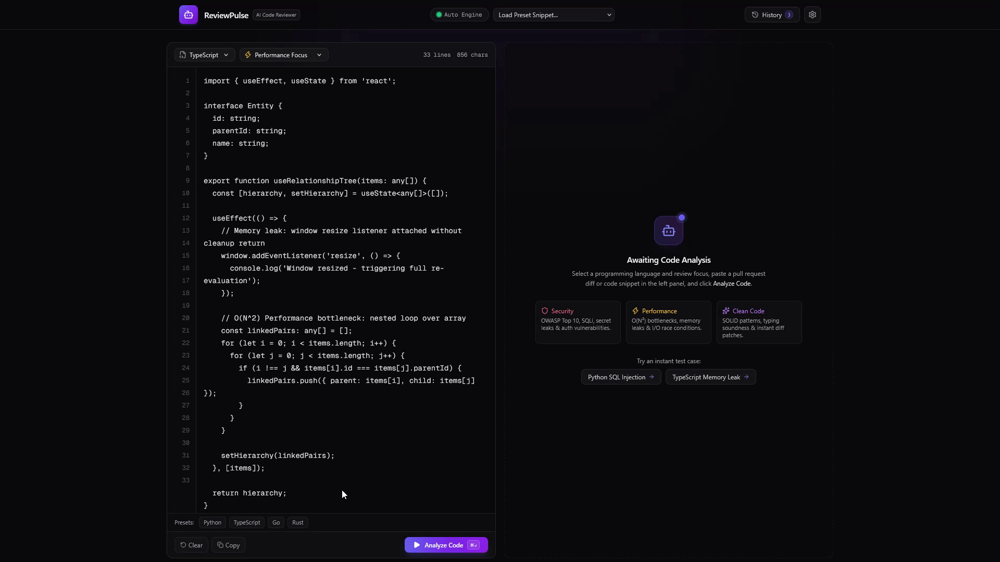

# 🤖 ReviewPulse — AI Code Reviewer for Pull Requests & Snippets

[-black.svg)](https://nextjs.org/)

> **ReviewPulse** is a production-ready service for automated analysis of pull requests and code snippets using AI with strictly structured JSON outputs, multi-level vulnerability detection, and automated patch generation.  
> 🌐 **Live Demo:** [ai-code-reviewer-eight-vert.vercel.app](https://ai-code-reviewer-eight-vert.vercel.app/)  

---

## 🌟 Key Features

* **Dual-Pane Split Interface:**
  * **Input Panel:** Support for 12 programming languages, customizable review focus (Security, Performance, Clean Code), code editor with line numbering, and presets for real-world vulnerabilities (SQLi, memory leaks).
  * **Output Panel:** Interactive circular code quality score gauge (0-100), severity-based issue filtering, vulnerability cards with instant patches, and quick PR export options.
* **Backend Architecture:**
  * Built-in static heuristic analyzer (AST Mock) for zero-config out-of-the-box local testing.
  * Integration with OpenAI (GPT-4o) and Anthropic (Claude 3.5 Sonnet) via Structured Outputs.
  * Middleware for structured logging and rate limiting.
  * PostgreSQL persistence layer powered by Prisma ORM.

---

## 📐 Architecture Diagram

📂 Project Structure
Plaintext

project#1/
├── backend/                  # Backend API service (Express + TypeScript)
│   ├── prisma/
│   │   └── schema.prisma     # PostgreSQL Prisma schema
│   ├── src/
│   │   ├── config/           # Environment variable validation
│   │   ├── controllers/      # Review controllers
│   │   ├── middlewares/      # Error handling, logger, rate limiting
│   │   ├── routes/           # API v1 routes
│   │   ├── schemas/          # Zod validation schemas
│   │   ├── services/         # Business logic and LLM providers
│   │   ├── types/            # TypeScript type definitions
│   │   └── server.ts         # Server entry point
│   ├── package.json
│   └── tsconfig.json
│
├── frontend/                 # Frontend application (Next.js 16)
│   ├── src/
│   │   ├── app/              # App Router, styles, layout
│   │   ├── components/       # UI components (Editor, Dashboard, Cards)
│   │   ├── lib/              # API clients and utilities
│   │   ├── store/            # Zustand state management
│   │   └── types/            # Frontend interfaces
│   ├── package.json
│   └── tailwind.config.ts
│
└── README.md

🚀 Quick Start
Prerequisites

    Node.js v18.0.0+ (v20+ recommended)

    npm or pnpm

Installation & Running

Install dependencies from the root directory:
Bash

npm run install:all

To run both Backend (port 4000) and Frontend (port 3000) concurrently:
Bash

npm run dev

Open http://localhost:3000 in your browser.
🔑 API Keys Configuration (Optional)

The service works out of the box using the built-in heuristic AST engine. If you want to connect real LLM providers:

    Specify keys in backend/.env:
    Фрагмент кода

    OPENAI_API_KEY="sk-..."
    ANTHROPIC_API_KEY="sk-ant-..."
    DEFAULT_LLM_PROVIDER="auto"

    Or configure your API key directly in the web UI by clicking the Settings icon. Keys are stored locally in your browser.

📡 API Specification
Analyze Code

POST /api/v1/review/analyze

Request Body:
JSON

{
  "code": "import sqlite3\n\ndef get_user(uid):\n    cursor.execute(\"SELECT * FROM users WHERE id = \" + uid)",
  "language": "python",
  "focus": "security",
  "provider": "auto"
}

Response (200 OK):
JSON

{
  "summary": "Review identified critical vulnerabilities. Remediation is required.",
  "score": 65,
  "issues": [
    {
      "severity": "critical",
      "line": 4,
      "title": "SQL Injection",
      "description": "Dynamic SQL query constructed via direct string concatenation.",
      "patch": "cursor.execute(\"SELECT * FROM users WHERE id = %s\", (user_id,))"
    }
  ],
  "metadata": {
    "provider": "Heuristic Engine (Mock)",
    "processingTimeMs": 457
  }
}

🗄️ Database

Architecture supports PostgreSQL for persisting review history:
Фрагмент кода

model User {
  id      String   @id @default(uuid())
  email   String   @unique
  reviews Review[]
}

model Review {
  id          String   @id @default(uuid())
  codeSnippet String   @db.Text
  language    String
  score       Int
  issues      Issue[]
}

model Issue {
  id       String   @id @default(uuid())
  reviewId String
  severity String
  line     Int
  title    String
  patch    String   @db.Text
}

📄 License

MIT. Designed for high performance, clean architecture, and modern developer aesthetics.